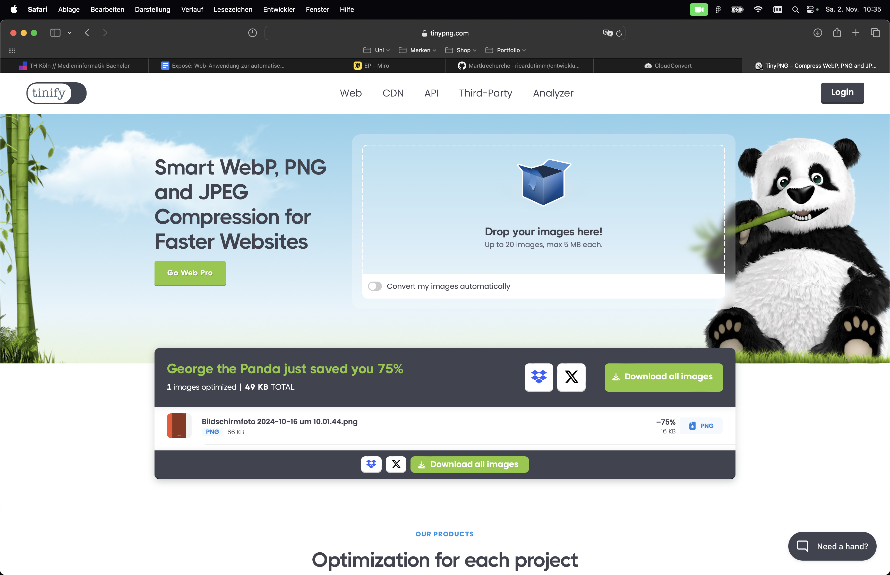

# Shrinkify Audit 1
- Möglichkeit für Kunden große Bilder, Videos und Audiodateien vor dem Hochladen in ein Content-Management-System (CMS) automatisch zu optimieren
- um Speicherprobleme und Performance-Einbußen zu verhindern

## Concept Map

## User Flows

## Proof of Concepts
| **Priorität** | **Herausforderung**                      | **Beschreibung**                                                                                                               | **Unterherausforderungen**                                                                                                   |
|---------------|------------------------------------------|-------------------------------------------------------------------------------------------------------------------------------|-------------------------------------------------------------------------------------------------------------------------------|
| 1             | Umgang mit großen Dateien                | Sicherstellen, dass große Dateien schnell und ohne Verzögerungen verarbeitet werden können.                                   | - Reduzierung der Serverbelastung bei großen Dateien   - Vermeidung von Upload-Verzögerungen   - Verwaltung von Datei-Uploads ohne Qualitätsverlust   - Effiziente Dateikomprimierung, um Dateigröße zu reduzieren |
| 2             | Intuitiver Upload-Prozess                | Entwicklung einer intuitiven Benutzeroberfläche, die die Nutzer durch den Upload-Prozess leitet                        | - Fortschrittsanzeige für Uploads   - Automatische Verarbeitung nach dem Upload   - Implementierung eines Drag and Drop Upload-Bereichs   - Optionen für alternativen Upload bieten (OneDrive, Dropbox...)   - Bereitstellung einer Smartphone Ansicht (Responsive Design)|
| 3             | Sicherheitsanforderungen                 | Schutz vor unautorisiertem Zugriff durch sichere Links und Implementierung eines Dateiprüfungssystems.                        | - Implementierung von sicheren Links   - Authentifizierung von Asset-Owner ohne Login   - Zugriffsbeschränkungen je nach Nutzerrolle   - Sichere & kontrollierte Weitergabe an autorisierte Mitarbeiter   - Authentifizierung von Content-Managern |
| 4             | Skalierbarkeit und Performance  | Gewährleisten, dass das System bei gleichzeitiger Nutzung mehrerer Asset-Owner stabil bleibt.                                 | - Unterstützung von mehreren gleichzeitigen Uploads   - Optimierung der Systemarchitektur für Lastverteilung   - Implementierung von Lastspitzen-Management |

## Personas

### Jonas Weber
- Alter: 38 Jahre
- Geschlecht: Männlich
- Job Titel: Projektleiter bei Pixel & Code Technologies (seit 15 Jahren)
- Work Hours: 40-45 Stunden pro Woche
- Ausbildung: Bachelor in Informatik mit Schwerpunkt Webentwicklung
- Standort: Berlin, Deutschland
- Einkommen: 75.000 EUR pro Jahr
- Family: Verheiratet, 2 Kinder (7 und 10 Jahre)
- Interessen: Rennrad fahren, Gartenarbeit an freien Wochenenden

### Lara Fischer
- Alter: 27 Jahre
- Geschlecht: Weiblich
- Job Titel: Creative Director bei MediaFlare (seit 3 Jahren)
- Work Hours: 45-50 Stunden pro Woche
- Ausbildung: Master in Kommunikationswissenschaften und Medienmanagement
- Standort: Hamburg, Deutschland
- Einkommen: 65.000 EUR pro Jahr
- Family: Ledig, lebt mit Partner zusammen
- Interessen: True Crime Podcasts, liest gerne Fantasy Romane

### Max Müller
- Alter: 30 Jahre
- Geschlecht: Männlich
- Job Titel: Marketing Specialist bei MediaFlare (seit 5 Monaten)
- Work Hours: 40-45 Stunden pro Woche
- Ausbildung: Bachelor in Marketing und Kommunikationswissenschaften
- Standort: Hamburg, Deutschland
- Einkommen: 50.000 EUR pro Jahr
- Family: Verheiratet, keine Kinder
- Interessen: Fotografie, Elektro Musik

## Marktrecherche
### Cloudinary

**Pro:**
- viele Optionen Assets einzufügen (image search google, web adress, dropbox)
- Media Library
- Bildbearbeitung
- auch Video Optimierung
- unterstützt Performance der Website

**Kontra:**
- Anmeldung

### TinyPNG

**Pro:**
- mehrere Uploadmöglichkeiten (dropbox etc.)
- Bildbearbeitung
- keine Anmeldung nötig
- API
- unterstützt Performance der Website

**Kontra:**
- nimmt begrenzte Anzahl von Dateiformaten an
- Pro Version für einige Features nötig

### Kraken.io

**Pro:**
- Verschiedene Upload Möglichkeiten (Dropbox, ZIP etc.)
- Resizing 
- keine Anmeldung möglich

**Kontra:**
- Pro Version für einige Features nötig
- eigene Angaben für Kompression