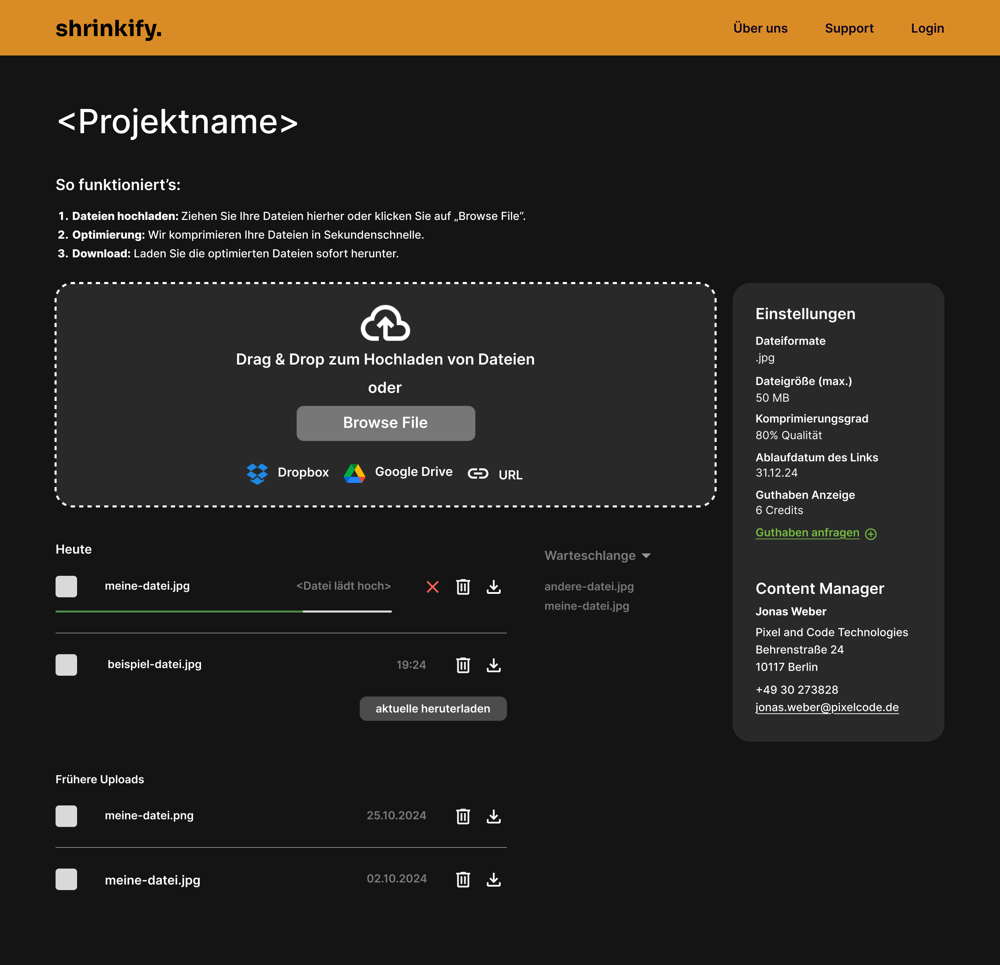
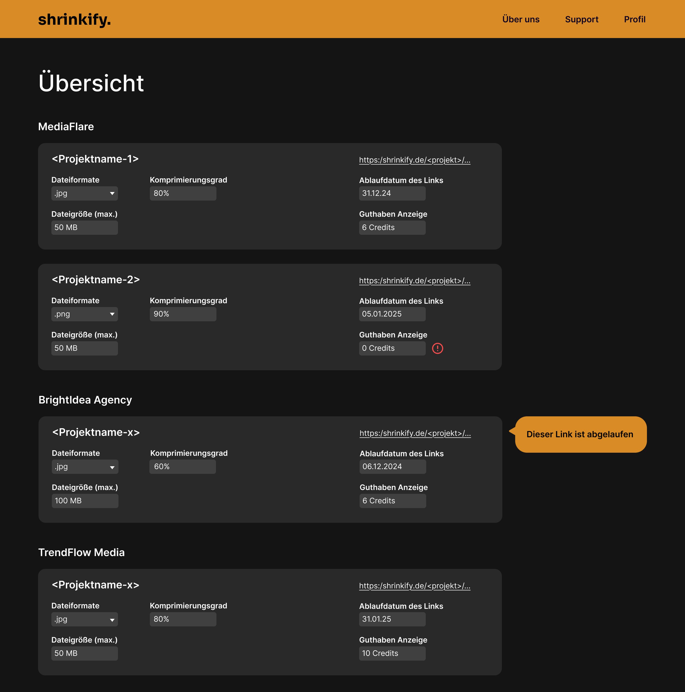

# Shrinkify Audit 2

## Design-Entscheidungen

Für unser Projekt haben wir uns auf zwei Design-Optionen festgelegt:  
Beide Designs teilen den gleichen strukturellen Aufbau und unterscheiden sich ausschließlich in der Farbwahl.

1. **Graues Design**  
   - Basisfarbe: Grau  
   - Header-Akzent: Orange, um visuell hervorzustechen  

**Linkpage:**
   

**Admin-Dashboard**
   

2. **Lila Design**  
   - Hintergrund mit Farbverlauf: Dunkel Lila → Dunkel Blau  
   - Generelles Farbschema: Lila  

**Linkpage:**
   

**Admin-Dashboard**
   

